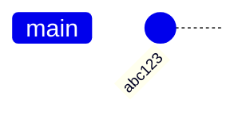
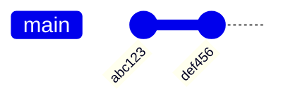

### In-Class Activity

## Part I

Graph (draw) the following seven functions on an $n$ vs. $y = f(n)$ axis.

You are free to use the Desmos online graphing calculator or ask Wolfram alpha the following questions.

Submit an image of your drawing as an image to the Canvas workshop.

## Part II

Pair up with the person next to you. Copy the grid below into your computer's clipboard, and paste into a text editor (VS Code, whatever you edit code with).

```
|_|_|_|1
|_|_|_|2
|_|_|_|3
 1 2 3
```

[Here are rules how to play.](https://en.wikipedia.org/wiki/Tic-tac-toe)

We'll play tic-tac-toe on an ASCII grid that can be stored in plaintext like this, that you and your partner will commit, pull to merge any changes from other games, and push to GitHub.


[Graphs in Game Theory](https://medium.com/@jshreyas12/graphs-in-game-theory-8c6c09fa5d45)


### Example Game


### A Side Note About Merge Conflicts

Before we show the same as git commits instead of an abstract graph, let's talk about a problem that might occur with you
and your opponent this afternoon when you attempt to play Git-Tac-Toe.

If two people edit a file at the same time (let's say you and your opponent both add your names to the README.md file)
you might be heading for a merge conflict. This is a normal part of software projects with more than one user (and
sometimes you can even have conflicts with yourself working on different machines).

If one of your commits and pushes their changes to the remote (GitHub) first, the other one will see this message
saying that their local and remote repos have diverged.


What to do next? Well, it is not possible to push in this case and expect GitHub to know how to merge this.


Git is telling you that as far as it can tell, you are the one without the latest changes, so if you want to push, you
have to first pull and resolve the merges to your satisfaction locally, then commit and push again.

#### Local and Remote that Can Be Fast-Forwarded

"Fast-forward merges" between a local and remote mean that one of them is just a subset of the other, and
different commits can be added in a straight line to sync them.

For example, if your local repo looks like this


and your remote repo looks like this



#### Local and Remote After Fast-Forwarding

Then the local can be "fast-forwarded" by simply pulling one single commit `def456` and appending it to your local repo.
Then both local and remote are now in sync, now merge conflicts or resolutions needed.


and your remote repo looks like this


#### Default Merge Strategy

Since in our example above, the local can't be fast-forwarded to match the remote,
when you `git pull`, you'll be asked the first time what your default merge strategy is.

For this class, the default strategy of merging is to set `rebase` to `false`.


#### X Makes Move 2

In order to pull and merge the change from remote, we're going to commit a move locally first, `X` makes move 2.


When you commit successfully (locally), `git` will display the commit hash, usually the first 7 characters.
You can see above that this most recent commit has hash `d8fa02b`

You can then use the hash to dump the complete contents of what was committed in this node of the git graph.
For example, the diff of the lines added and removed, as well as the timestamp, the author, etc.


When you type

```
git pull
```

after this commit, you'll see the merge commit message appear giving you a chance to add more details if you wish.
In this case, it uses the default text editor `nano` on many UNIX systems.

You can also set your `GIT_EDITOR` environment variable in your shell file to `vim` or to `code`, if you've aliased `code` to VSCode on your
system.

Save and exit, then the merge will complete, and a merge is just another commit.


When we show the local graph, we see that this most recent merge is the latest commit to the graph,
and including it, we have 4 commits locally that are not on the remote yet.


We can now `git push` to the remote.


On the GitHub remote, you can see these commits are displayed as if they were a nice linear timeline


We know that is not the case, but the fact that we were able to push means that the latest commit is a valid merge
combining the latest state on both the remote and the local, so no information was lost.

Any changes can be reverted if necessary in case we want to undo or go back in our game.

On our github remote, we can see the latest game state in `board.txt`

https://github.com/TheEvergreenStateCollege/game-00/commit/d8fa02bd69b9caa5c35cb32c0980fbeb01e2040f 

```
 _ _ _
|_|_|X|1
|_|O|_|2
|_|_|_|3
 1 2 3
```

### Tic-Tac-Toe Game in Git Commits

Remember the graph? Now we label the nodes with git hashes, and show the diffs that
move the game state from one node to the next.

Here's the first commit that sets up the empty board, and also writes the players names into README.md


The next commit hash `cbaff95` makes the first move for `O`.


The next commit makes the second move to `X`.


After that, `O` make the third move, and the screenshot above shows how you will play Git-Tac-Toe on your own.
* Edit the text file `board.txt`
* Add your `O` or `X`
* `git add`, `git commit`, and `git push`


Below, we go back in time so that `O` can make a new Move 5 to change the game's outcome.
We checkout a specific past commit, and then use the new `git switch` command to create a new branch starting at that point.

Note that `main` was our only branch before, and was the same as `HEAD`, but now as we create a new branch,
`HEAD` follows `redo` and `main` stays with the original game where `X` won.

We can see that Git branches are just labels or sticky notes. They don't refer to the whole timeline, just a particular
commit in a timeline, usually the latest one, and they can be moved around.


A lot of mayhem can follow if you don't keep your branch names straight between local and remote.
In the next screenshot, we try to push without specify a branch name, and Git reminds us to be explicit,
and strongly recommends that we keep the local and remote branch names the same.


Here is the Pull Request that results from us going "back in time" to make a new Move 5.

https://github.com/TheEvergreenStateCollege/game-00/pull/1

The merge conflict is not surprising, remember. Both the `redo` and the `main` branch have changes to the same file `board.txt`


At this point we end our demonstration, but in the afternoon lab, you are asked to
play the game to the (bitter?) end to show that its outcome is indeed different than the original game.

Then merge your `redo` branch into `main` locally, resolve any conflicts, add, commit, push, merge, and close the Pull Request.

Copy the URL of your git commit and submit it to the canvas workshop, along with your image of graphs above.
