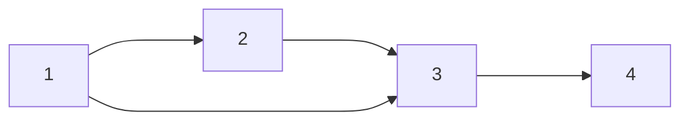

# Core DSA - Week 09
2024-12-03 Tuesday

(Dictionary prop)

## Announcements

* Final project delayed until next quarter.
  * not enough time to discuss and execute intermediate steps at a high level of quality
  * DSA Synthesis HW 10 will ask you to commit what code you have and write up a short README.
* DSA Game 10 next Tuesday
  * will cover your answers for DSA Workshop 09 and zyBooks HW 08, 09, 10
  * on Monday we'llgo over the questions and make study sheets.

## Binary Search Trees

Dictionary is an ADT. What are the seven operations allowed on it, from the reading in Section 3.3?

Before, in Week 02, we created a dictionary as a sorted array.

Now, we can create it with a binary search tree (BST), with BSTNodes that have a left and right child.

```
class BSTNode<T> {
    T value;
    BSTNode<T> left;
    BSTNode<T> right;
}
```

The running time depends on the (internal) representation.
* singly-linked list, unsorted
* singly-linked list, sorted
* doubly-linked list, unsorted
* doubly-linked list sorted
* array, sorted
* array, unsorted

Question: Why do we formulate invariants for representations?
* It helps us write code that is correct
* It helps us prove correctness mathematically, independent of code

Let's draw the dictionary formed with the following animal names from DSA Game 06,
and come up with some invariants.

Existing dictionary
`[aardvark, chinchilla, marmot, quail, walrus]`

Insert the following
`[newt, yellowtail, dragon]`

### Final Quiz Question: write pseudocode for a Thesaurus ADT.

You don't have to do this now. Keep it in the back of your mind.

We'll learn two more data structures (graphs and hashmaps) that may be useful.

A thesaurus associates a *term* with a list of *synonyms* (other terms that are similar to it) and
*antonyms* (other terms that have the opposite meaning). Synonyms and antonyms are mutual.

If "adamantine" is a synonym of "hard", then "hard" is a synonym of "adamantine".

If "obfuscatory" is an antonym of "concise", then "concise" is also an antonym of "obfuscatory."

You should support the following operations with the most efficient running time and space possible.

You're allowed to combine multiple existing data structures or algorithms, of the same or different types,
for the internal representation of your Thesaurus ADT.

* `insert(term, [ list of synonyms ], [ list of antonyms ] )`
* `lookup(term) -> [ list of synonyms ], [ list of antonyms ]`
* `delete(term)`

## Graph Introduction

Represent a binary relation (the edge) between entities (the nodes, or vertices).

With a partner, pick three or four examples and discuss how they can be represented as graph data structures
with questions answered by graph algorithms. In each case, what are the nodes and edges?

* Social media follows/friends (Instagram)
* Street corners in a city connected by buses or subways
  [https://upload.wikimedia.org/wikipedia/commons/b/bc/Vancouver_Transit_Network_Map.svg]
  "Given all possible streets, only some of them are bus / subway routes. Which ones?"

* [Characters in Les Miserable](https://studentwork.prattsi.org/infovis/visualization/les-miserables-character-network-visualization/)
* [MapQuest / Google Maps street directions, aka Dijkstra's algorithm]()
* [Traveling salesman problem (TSP), or Hamiltonian circuit](https://en.wikipedia.org/wiki/Travelling_salesman_problem)
* [Eulerian circuit (walking the 7 bridges of Konigsberg](https://en.wikipedia.org/wiki/Eulerian_path)
  * this can be used in assembling genomes from fragments

* [City street planning: where is there congestion? Max-flow, min-cut problems.](https://internationalpubls.com/index.php/pmj/article/view/2423/1478)
* Electrical / plumbing / HVAC ducting for buildings on campus. [Minimum spanning tree (MST), Prim's or Kruskal's algorithm]()
  * all buildings need to be connected to some other building, but not to all other buildings, to save material and money.
* [Facility location; where to place your factory in connected grid of city blocks?](https://optimization.cbe.cornell.edu/index.php?title=Facility_location_problem)
  

* Topological sorting: college courses or jobs have prerequisites, how to take them in the right order?
* Bipartite matching: dating algorithms, medical school matching.

Graph algorithms are a very large topic and would fill several other courses on their own.

$$ G = (V,E) $$

Input size is usually given as number of vertices.

$$ n = |V| $$

### Undirected Graphs

All edges go in both directions.

$$ E: V \times V \rightarrow true $$

$$ (v1,v2) \in E \Rightarrow (v2,v1) \in E $$

### Directed Graphs

Edges are in general one-way.

### Representation

How we represent edges is the main choice.

Adjacency Matrix versus Adjacency (Linked) List



#### Adjacency matrix

```
0 1 1 0
0 0 1 0
0 0 0 1
0 0 0 0
```
If these edges for undirected, how would this matrix look?
What data type in a programming language would you use for this?

#### Adjacency list

#### Adjacency matrix

```
<1> --> [ 2, 3 ]
<2> --> [ 3 ]
<3> --> [ 4 ]
```
If these edges for undirected, how would this matrix look?
What data type in a programming language would you use for this?

#### Tradeoffs
* Sparsity; how many edges versus how many nodes?
  if edges much fewer than nodes (e.g. websites on internet with outgoing links, graph will be mostly zeros)
* Fast Indexing versus List Traversal

### Graph Algorithms [In-Class Partner Activity]

Solving a maze
* depth first search

https://visualgo.net/en/dfsbfs

Together as a class, we'll go over the Death First Search Puzzle.
https://www.codingame.com/ide/puzzle/death-first-search-episode-1

With a partner, practice pair programming.
  * Sit at the driver's computer

* Together [translate the following source code into English](https://github.com/TheEvergreenStateCollege/upper-division-cs-24-25/blob/main/dsa-24au/week-09/DeathFirstSearch.java)
  * feel free to use reference / variable names and types
  * choose either an adjacency graph or adjacency list representation.
  * type it in a separate text editor, or write it out on paper

* Together, using your English algorithm, translate it back into Java
  * Load this puzzle and create / signin with your GitHub account
  * https://www.codingame.com/ide/puzzle/death-first-search-episode-1
  * Type your solution in and run the test cases. When they all pass, you may submit.
 
Copy and paste, or scan a photo, of your English translation into the DSA Workshop 09 Canvas Assignment.

## zyBooks Lab

Finish graph representations.

There are many files, we can group them by inheritance hierarchy to make sense of them.

[Command Pattern](https://refactoring.guru/design-patterns/command)

## PageRank as a Graph Eigenvector Problem

https://pi.math.cornell.edu/~mec/Winter2009/RalucaRemus/Lecture3/lecture3.html

## Next Time: HashMaps and Constant-Time Everything

[dsa-23au Graph Notes](https://github.com/TheEvergreenStateCollege/upper-division-cs-23-24/blob/af427e1d7662f946f1ff7ad7ba569364934dac22/dsa-23au/docs/week-09/2023-11-27.md)
