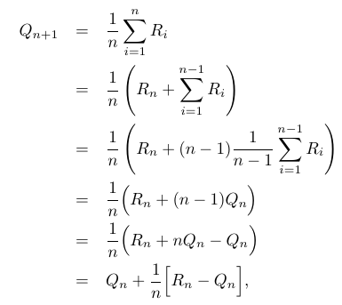

# Figure 2.3
Found on page 53



This formula shows how a running average can be made by incorporating the difference between each new result with the existing average.

## Python Implementation

```python
# Temporal Difference Function
def get_estimate(iteration=1, reward=0, expectation=0):
    # Proportion of this iteration to the total
    ratio = 1 / iteration
    # Difference between current reward and expectation
    difference = reward - expectation
    # New estimate = old estimate + proportional difference
    return expectation + ratio * difference

# Starting Inputs:
sample_rewards = [1, 2, 3, 4, 5, 6, 7, 8, 9, 10]
estimate = 0 # Starting estimate

# Loop over rewards, adjusting the estimate each time
for iteration, reward in enumerate(sample_rewards, start=1):
    estimate = get_estimate(iteration, reward, estimate)
    print(estimate) # Print to show progress
```

Result when executed:

```
1.0
1.5
2.0
2.5
3.0
3.5
4.0
4.5
5.0
5.5
```

The result at each step matches the average of all processed rewards.
