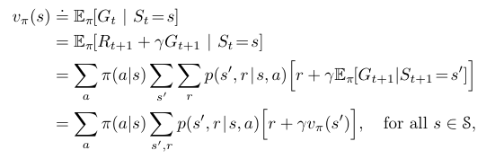

# Figure 3.14
Found on page 81



This formula shows the Bellman Equation, used to evaluate the policy of a position based on the actions that can be taken, weighted by the probability of taking each action.

## Python Implementation

```python
# Bellman Equation Function
def get_estimate(reward=0, actions=[0], discount=0.9):
    # Start estimate with current reward
    estimate = reward
    # Loop over all potential actions
    for action in actions:
        # Probability of taking the action (if chosen randomly)
        probability = 1.0 / len(actions)
        # Add proportional value to the estimate
        estimate += action * discount * probability
    return estimate

# Starting Inputs:
reward = 1 # Reward from the current state
actions = [-1, 2, 5, 10] # Policy evaluation of potential actions
discount = 0.9 # Falloff over distance

estimate = get_estimate(reward, actions, discount)
print(estimate)
```

Result when executed:

```
4.6
```

The result shows the average reward of all potential actions if the action is chosen at random.
