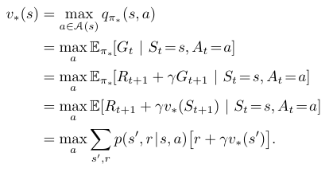

# Figure 3.19
Found on page 85



This formula shows the Bellman Optimality Equation, used to evaluate the policy of a position based on the actions that can be taken, weighted by the rewards and distance from them.

## Python Implementation

```python
```

Result when executed:

```
```
