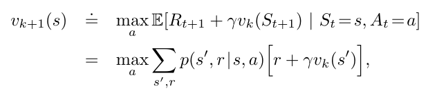

# Figure 4.10
Found on page 83



This formula shows the Value Iteration, which combines the policy improvement and policy evaluation steps. Over multiple sweeps it should converge on an optimal policy valuation.

## Python Implementation

```python
# Value Iteration Function
def value_iteration(states={}, policy={}, discount=0.9):
  next_states = {}
  for state, estimate in states:
    # Start max at lowest number possible, negative infinity
    max_value = float('-inf')
    # Loop over potential actions from the given state
    new_estimate = 0
    for action, outcome in policy:
      # Skip over potentials from different states
      if state not in action:
        continue
      new_estimate += outcome * (reward + discount * estimate)
    next_states[state] = new_estimate
  return next_states

# Starting Inputs:
reward = 1 # Reward from the current state
actions = [-1, 2, 5, 10] # Policy evaluation of potential actions
discount = 0.9 # Falloff over distance

estimate = get_estimate(reward, actions, discount)
print(estimate)
```

Result when executed:

```
4.6
```

The result shows the average reward of all potential actions if the action is chosen at random.
