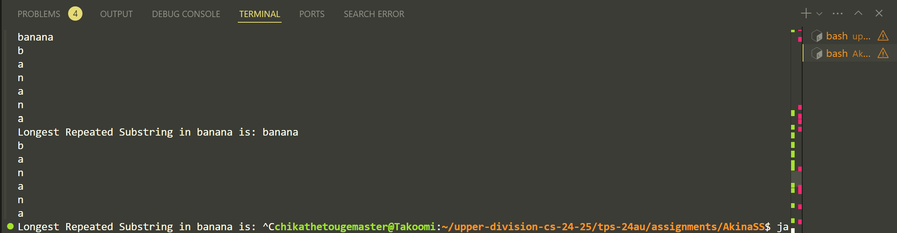

So I've been trying this for all the past weeks until now and honestly I'm not sure if I'm doing it correctly.

The previous code that I sent to you was broken in a lot of ways. Most notably, it freezes the program and pop up some kind of memory error.

So I ended up checking out [this tutorial of building a suffix tree using the Ukkonen's algorithm](https://www.geeksforgeeks.org/ukkonens-suffix-tree-construction-part-1/?ref=next_article) like the past year, ditch the previous code and start from building a suffix tree back up then attach elements in but also failed.

That's when I also saw a tutorial from geeksforgeeks showcase the assignment [of this exact same problem we have](https://www.geeksforgeeks.org/suffix-tree-application-3-longest-repeated-substring/), the code for this is also include in this commit, albeit it's a C code. I translate the code to java and now it has this problem of not receiving input at all like what it shows here. 

When I test the original C code itself, for some unknown reason it doesn't work either even with the use of the original input. What it gives is just "No repeating substring found" without any error, at this point I got no idea what to do anymore and I'm pretty burned out. So I decide to capture these experience for you in hope for your understanding. I'm going to finish the rest of the missing homework that I had now. I'm sorry there's no other way I can find to finish this assignment.