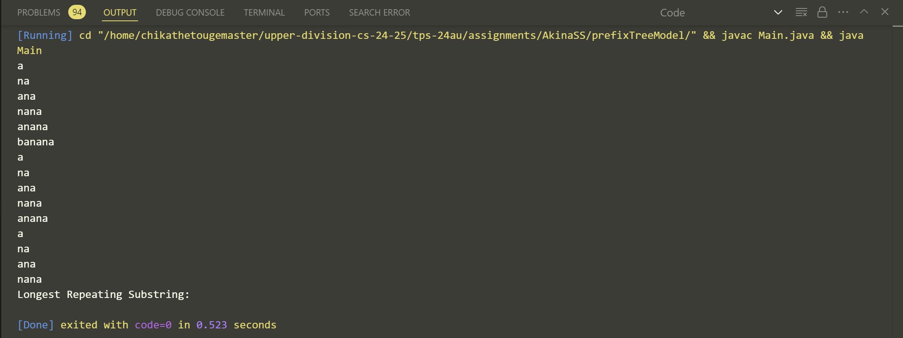
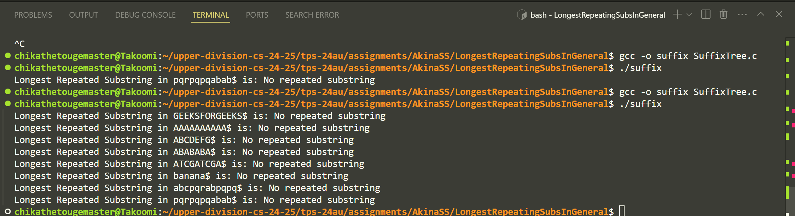
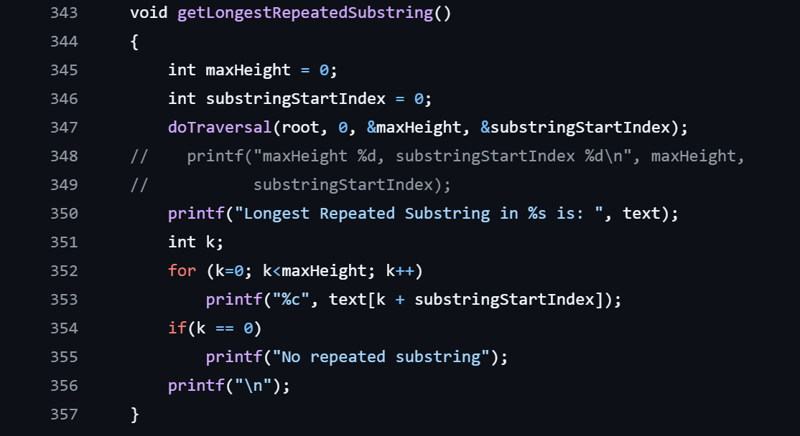

## Suffix Tree:

So I've been trying this for all the past weeks until now and honestly I'm not sure if I'm doing it correctly.

The previous code that I sent to you was broken in a lot of ways. Most notably, it freezes the program and pop up some kind of memory error.

So I ended up checking out [this tutorial of building a suffix tree using the Ukkonen's algorithm](https://www.geeksforgeeks.org/ukkonens-suffix-tree-construction-part-1/?ref=next_article) like the past year, ditch the previous code and start from building a suffix tree back up then attach elements in but also failed.

That's when I also saw a tutorial from geeksforgeeks showcase the assignment [of this exact same problem we have](https://www.geeksforgeeks.org/suffix-tree-application-3-longest-repeated-substring/), the code for this is also include in this commit, albeit it's a C code. I translate the code to java and now it has this problem of not receiving input at all like what it shows here. 

When I test the original C code itself, for some unknown reason it doesn't work either even with the use of the original input. What it gives is just "No repeating substring found" without any error, at this point I got no idea what to do anymore and I'm pretty burned out. So I decide to capture these experience for you in hope for your understanding. I'm going to finish the rest of the missing homework that I had now. I'm sorry there's no other way I can find to finish this assignment.

## Prefix Tree:
Unfortunately it doesn't pass the test cases or have any improvements so far from it as it has been stuck on some issues relates to packaging. I decide to use your Java implementation of prefix tree and build a solver from there. The approach is somehow similar to the suffix tree but with little changes to it. For some reason after I finish the code and test it out, it has some issues that some variables are not detected even though they were all in the same folder. Further investigation shows that the superclass that my prefix tree extends to is attached to the original implementation on your folder. I'm not sure if it's because of the way I package it or something else but if I decide to ignore it and test the code, it's working and this is what it shows on my terminal.

Bringing this to Kattis, obviously, shows no positive sign as well.

I felt like at this point, it should be working but for some reason it doesn't. It could be different outputs expected but still in general I still need to solve the no-output problem that has been happens on both this and the suffix tree code as well. I might not do as much as I can to finish this assignment but I felt like there's a way to fix this.

Update: I'm going to put here a picture of the output that I got from the code from geeksforgeeks.

Update 2: I just find out today that for some unknown reason, the geeksforgeeks code (SuffixTree.c) is hard-coding the maxHeight and substringStartIndex in getLongestRepeatingSubstring which makes the code always print out an empty string.

I suspect that it has something to do with either the template or they want to do it recursively to found out the answer. I have fixed it in a temporary way but not sure if it's the right way to do it.

The fix for this currently is I've add in a few extra line of code to revert the hardcoding and use the text value. It turns out that C doesn't have hashmap, dictionary or anything like that so I have to use a simple array to store the key and value. There's some other package that I can use to do this but I want to test to see if I can still do it with the original compiler. I've been thinking about this for a while now and it doesn't work so I don't really have high hopes for this.

I think I'm going to step down for now with this implementation, I just can't think of anything to do with it, the code is not complete but the idea is there. The proposed fix here is iterate the strings and its' suffixes through the tree and record everytime it went through a node. If it's going in the first time, add the character value in the array, if it's going in as a repeated of what it's already have in the array, increase the counter for that value. Take the highest counter as a result and append it as a number of substring needs to print the longest repeating substring. That's all I can think of for now.