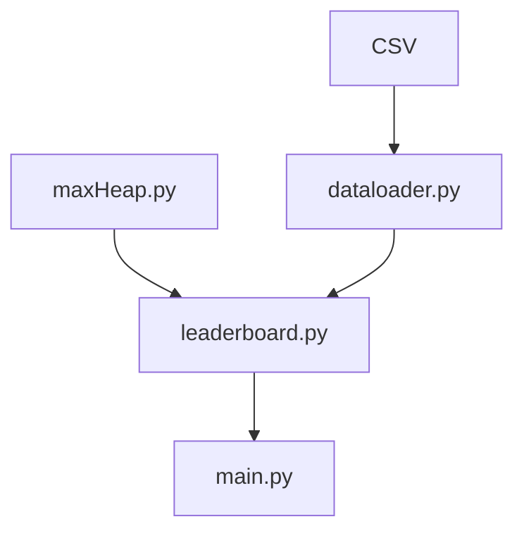

# Inspiration
```
The inspiration for this project was the love for soccer. I have seen many sports leaderboards and wanted to create my own. 
```
# Software Design


# How to Run 
```
The command is "python3 main.py"
You'll show with the menu that has the following description:

Welcome to the soccer leaderboard. Choose an option:
1: Show leaderboard for 2015
2: Show leaderboard for 2016
3: Show leaderboard for 2017
4: Show leaderboard for 2018
5: Show leaderboard for 2019
6: Show leaderboard for 2020
7: Show leaderboard for 2021
8: Show leaderboard for 2022
9: Show leaderboard for 2023
10: Show leaderboard for 2024
0: quit
Enter a number:

From this point, choose any number from 1-10 and it will show the following leaderboard for that year

When you're finished, type 0 to quit the menu

Try typing any number outside of 0-10 to see something happens!

No characters are allowed except numbers
```

# How we Built it
```
This Project was built using the python programming language. We were going to build our heap using the heapq module, but for practice, we were required to build our own implemenation which is in max_heap.py 
```

# Challenges 
A challennge for us was errors. Without using ChatGPT or having a professor, figuring out our bugs was hard. Also just programming in general was hard. I knew my ideas but putting them in code was the hard part. We also was busy, especially in Duck's case when he still do his final project for SE back then.

# Accomplishments we are Proud of
Getting a working project done on time. Duck also develop a main.py version that now can comply to any version of python, because the switch statement in python is a new thing

# What We learned
We leanred how to use CSVs in python, to build our own max heap, and pythons match case which is a switch statement from other languages. 

# What's Next for the Project
Not sure if we will continue the project, but some good ideas are using a modlue to make the interface look better, make a website from this and a GUI (same thing)
