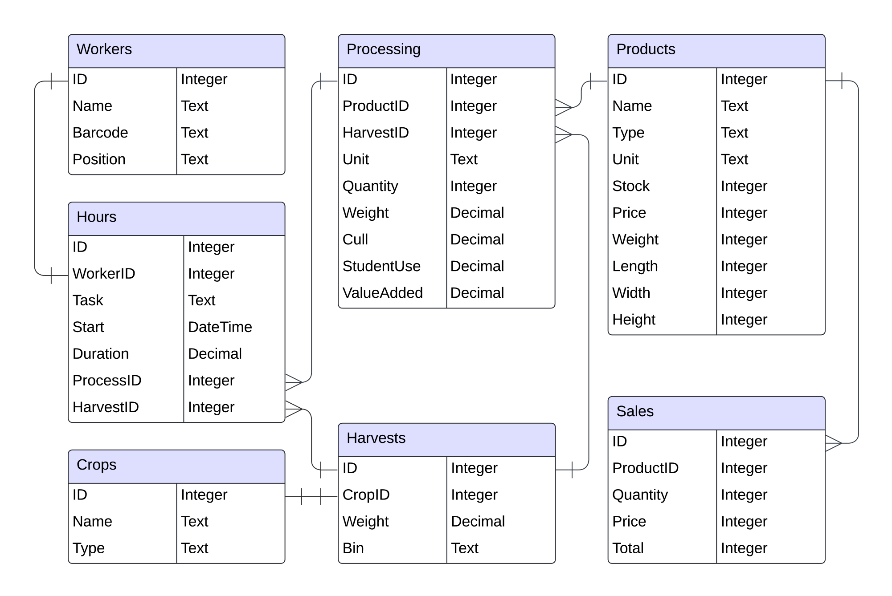
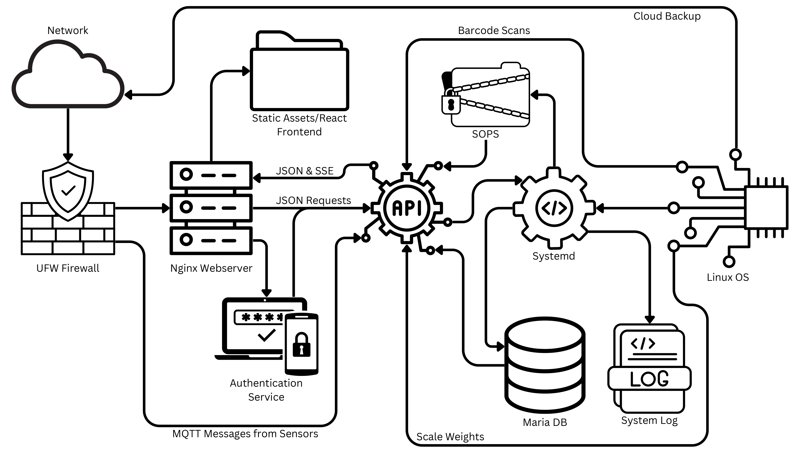

# Farm data processing script
Script that read through hours.json to print the number of hours each crop has been put into harvesting and how long it takes into processing how long each worker has worked and all the crops they worked on broken down for harvesting and processing. what are people doing? and what crops are getting the most attention? harvesting product and finished products. 

to run type `python3 hoursData.py` then follow the commands printed to the terminal

### What to expect
you can
- see person and what they are clocked in as doing
- search for an individual person by name or by their id and see what they are working on and for how long
    - barcode scanning will need to be implimented in the future
- search for a specific crop and see who is working on it and for how long and see how much effort is requiered to be put into it with its overall time spent

### Tech Stack
The raw data is stored in an SQL database. We use an API written in Go to retrieve JSON, which is then processed by Python into actionable information. The Python script uses a CLI interface to receive guidance for the user.

### Challenges
- Mockaroo provides inconsistencies and irrational data, even beyond what you could expect from the average user (which is impressive).
- Human parallelism was a challenge, we ended up working mostly in serial.
- Service availability was not fully implemented. We had to curl the JSON and send it back and forth.

### Accomplishments
- Everything prettymuch works.
- Huge number of lines of code.
- Thousands of data records (most of it nonsense)

### What We Learned
- Programming is hard.
- Python is fun, but can be messy.
- Mockaroo becomes tricky with many tables.

### Ideas of what would be implimented in a future project
Once the database is actually collecting real data these scripts can be used to see the time spent on the farm. Ideally the script would be changed to send data to a website front end for admins to look at and manage the information in a far more readable way than just command line output. 

## Diagrams

### Database Diagram

### Server Diagram

